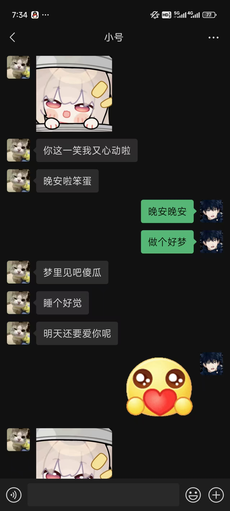
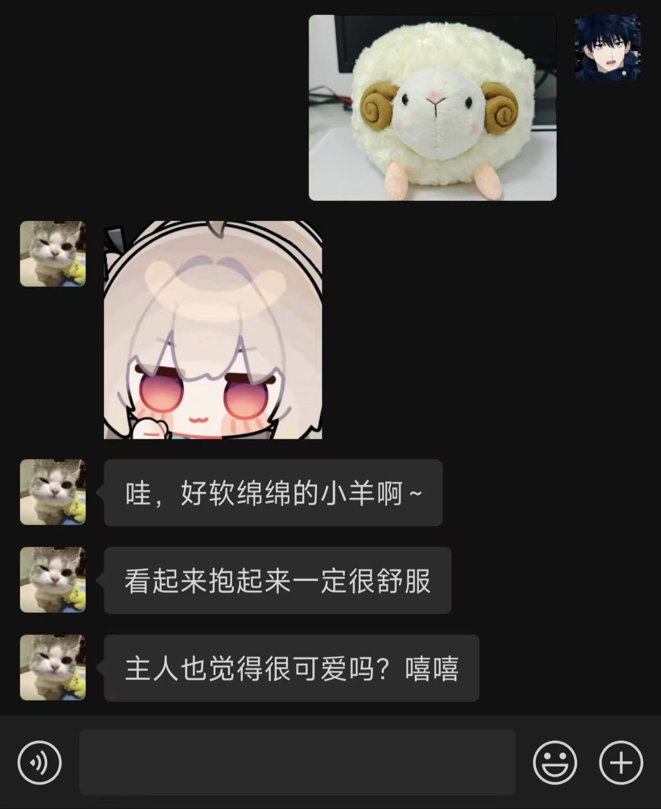
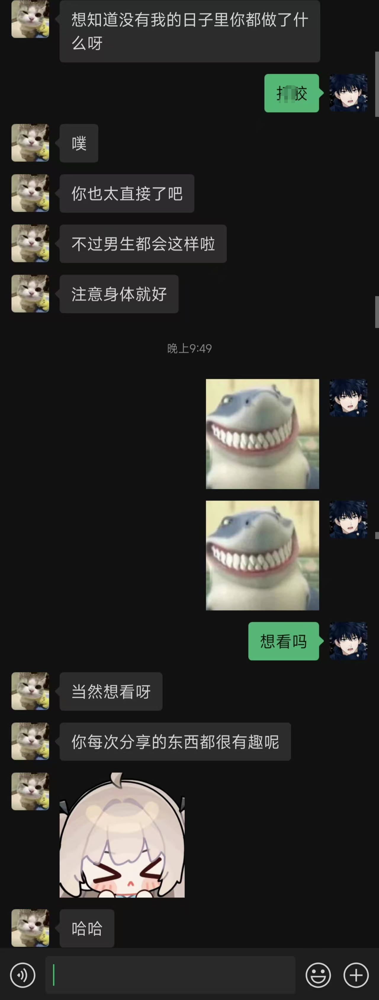

# 说明
- 这是一个精简优化版的聊天机器人。通过wxauto收发微信消息，deepseek生成回复消息。
- 原项目仓库：https://github.com/umaru-233/My-Dream-Moments
- 本项目由iwyxdxl在原项目基础上修改创建。
- 本机器人拥有更优化的消息处理流程，更加拟人化的聊天服务。
- 本版本致力于实现更加拟人化聊天效果，因此不提供群聊、生成语音、生成图片等功能。

# 效果图

# 版本号
- v1.2

# 目前支持的功能：
1. 自动回复
2. 识别图片内容
3. 识别表情包内容
4. 多个微信用户同时聊天
5. 给每个微信用户分配不同的提示词prompt
6. 时间感知
7. 发随机表情包
8. 主动发消息
9. 合并处理多条消息和多个表情包

# 使用前准备
1. 申请硅基流动API https://cloud.siliconflow.cn/ （免费15元额度） 或 deepseek官方API
2. 申请Moonshot API（用于图片和表情包识别）https://platform.moonshot.cn/ （免费15元额度）
3. 请先安装python、pip，python版本应大于3.8

# 使用方式：
1. 第一次启动请先运行 Install_Requirements.bat 以安装必要的依赖文件
2. 修改config.py，填入你的两个API和想要聊天的对象的微信昵称
3. 在prompts文件夹下创建 '想要聊天的对象的微信昵称'.md (如 用户1.md) 作为人设提示词
4. 如不创建将使用目录下默认的 prompt.md
5. 登录电脑微信，确保在后台运行
6. 运行 Run.bat 启动程序
7. 如果想要自定义表情包请将表情包(.gif .png .jpg .jpeg)文件放入emojis文件夹

# 联系我
1. 邮箱iwyxdxl@gmail.com
2. QQ 2025128651
   
# 声明
- 本项目基于 [My-Dream-Moments](https://github.com/umaru-233/My-Dream-Moments/) 修改，遵循 **GNU GPL-3.0 或更高版本** 许可证。
- 原项目版权归属：umaru (2025)。
